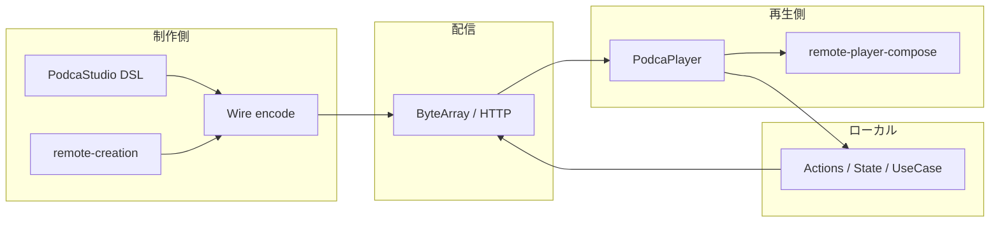

# Podca 基本設計書（v1）

| 項目 | 内容 |
|------|------|
| 文書種別 | 基本設計（アーキテクチャ・境界・v1 スコープ） |
| 版 | v1.5（完成計画書へのリンク） |
| 想定読者 | プロダクトオーナー、アーキテクト、クライアント／サーバー実装者、QA |
| 関連規約 | [AGENTS.md](../../AGENTS.md)（実装時の厳格ルール） |
| 下位・参照 | [sdui/ARCHITECTURE.md](../../sdui/ARCHITECTURE.md)、[sdui/remote/README.md](../../sdui/remote/README.md)、[sdui/remote/ANDROIDX_REMOTE_MAP.md](../../sdui/remote/ANDROIDX_REMOTE_MAP.md)、[sdui/protocol/README.md](../../sdui/protocol/README.md) |
| 詳細設計 | [DETAILED_DESIGN_v1.md](./DETAILED_DESIGN_v1.md)（シーケンス・評価順・エラー・検証マトリクス） |
| WBS | [WBS_PRODUCT_COMPLETE_v1.md](./WBS_PRODUCT_COMPLETE_v1.md)（プロダクト完成までの作業分解一覧） |
| 未完整理 | [PRODUCT_STATUS_INCOMPLETE_v1.md](./PRODUCT_STATUS_INCOMPLETE_v1.md)（未完成領域の一覧） |
| **完成計画** | **[PRODUCT_COMPLETION_PLAN_v1.md](./PRODUCT_COMPLETION_PLAN_v1.md)**（実行フェーズ・ゲート・Track R/S） |

---

## 1. 目的と位置づけ

### 1.1 プロダクト目的

Podca は **Hybrid SDUI**（サーバー駆動の UI 契約＋ローカル実処理）を、**単一の Wire 契約**（`sdui:protocol`）と **Kotlin Multiplatform（KMP）＋ Compose Multiplatform（CMP）** で実現するためのライブラリ群とサンプル（`composeApp`、`server`）からなる。

### 1.2 本書の役割

- **v1 の「何をもって完成とするか」**を宣言する（要件の上位にある合意文書）。
- 実装の詳細（フィールド単位の仕様）は **Protocol／Remote の .proto、対応表 README、テスト** を正とし、本書では **構成・責務・拡張順・受入条件** に留める。

### 1.3 用語

| 用語 | 意味 |
|------|------|
| **広い SDUI** | `material3.*` / `foundation.*` 等を `NodeProto` で表し、`PodcaStudio` → `PodcaPlayer` で再生する経路。 |
| **Podca Remote** | AndroidX **Compose Remote**（実装ソース）の挙動を **単一の真実源（SSoT）** とみなし、**`RemoteCanvasProgramProto` の op 列**＋**`remote-player-compose` インタプリタ**で再現するサブシステム。 |
| **糖衣** | `RemoteNodeProto`（`remote.Node`）のように、同一意味空間上の宣言的表現。新規表現力の **第一追加先は原則 canvas ops**（[AGENTS.md](../../AGENTS.md)）。 |
| **実用レベル（SDUI）** | 本番想定の画面を **Protocol → Studio → Player** のみで組め、サーバー配信バイト列が **本流**であり、ホストはランタイム・テーマ・ネットワーク等のインフラに限定される品質（[AGENTS.md](../../AGENTS.md) のデモ方針をプロダクト全体の規範とする）。 |

---

## 2. v1 スコープ（合意）

v1 は次の **2 本柱**を同時に満たす。

### 2.1 柱 A: SDUI を実用レベルにする

| ID | 受入条件（要約） |
|----|------------------|
| **A-1** | 画面構造・インタラクション・状態更新は **`NodeProto` 契約**で表現でき、`PodcaPlayer` が **未対応ノードでもクラッシュせず**子を再帰処理できる（フォールスルー方針は [sdui/ARCHITECTURE.md](../../sdui/ARCHITECTURE.md) に従う）。 |
| **A-2** | 新しい見た目／部品が必要な場合、**アプリ／サーバーだけの独自ラッパーで恒久回避しない**。原則 **Protocol → Studio → Player** の順で拡張する（[AGENTS.md](../../AGENTS.md)）。 |
| **A-3** | 紹介／マーケ用途の UI ツリーは **`sdui/marketing`** に **単一ソース**として置き、**Ktor 等でエンコードしたバイト列の取得が本流**とする。クライアント単体 `encode` は **フォールバック専用**（[AGENTS.md](../../AGENTS.md)）。 |
| **A-4** | `ClientEventProto` / `ActionResultProto` / `state_patch` による **操作→状態→再描画** のループが、サンプル経路で実証されている。 |

### 2.2 柱 B: Remote Compose 相当を **CMP × KMP 全ターゲット**で完走させる

**「CMP KMP 完全対応版」の定義（v1）**は次とする（AndroidX の **全 API 表面の数学的同一**ではなく、**Podca が契約する Remote サブセット**についての完走）。

| ID | 受入条件（要約） |
|----|------------------|
| **B-1** | `composeApp` が採用する **全ターゲット**（`android`、`iosArm64` / `iosSimulatorArm64`、`jvm`、`js`（browser）、`wasmJs`（browser））において、**`remote-player-compose` を依存する経路がビルド可能**であり、**`RemoteCanvasProgramProto` の解釈が `commonMain` 中心**で共通化されている。 |
| **B-2** | **AndroidX `RemoteCanvas` との対応**は [ANDROIDX_REMOTE_MAP.md](../../sdui/remote/ANDROIDX_REMOTE_MAP.md) を **契約書**とする。v1 完了時点で **表上「—」（未実装）の行はゼロ**（または Issue 化された明確な例外として文書に記載し、マップと同期）とする。 |
| **B-3** | **「△」（部分対応）**については、v1 では **プロダクトが採用する画面・オプに必要なものから ✓ へ昇格**し、残りは **意図的差分**としてマップに理由と将来方針が書かれていること。 |
| **B-4** | **プラットフォーム固有の制限**（例: 特定フラグが Android のみ反映される等）は **マップまたは proto コメントで明示**され、他ターゲットでは **無視／定義済みフォールバック**が一貫していること。 |
| **B-5** | リグレッション防止のため、**`./gradlew remoteVerifyJvm`**（およびプロジェクトが定める他の CI タスク）が **v1 ブランチのゲート**として運用される（[sdui/remote/README.md](../../sdui/remote/README.md)）。 |

> **注釈**: 「完全」は **「全ターゲットで Remote 契約を破綻なく再生できる」**ことを指す。Compose／Skiko 等の下位差による **ピクセル完全一致**までを v1 の必須としない場合がある。その場合は **B-4** で明示する。

---

## 3. システム構成

### 3.1 論理構成



- **制作**: `sdui/studio/*`、マーケツリー `sdui/marketing`、Remote ヘルパ `sdui/remote/remote-creation`。
- **契約**: `sdui/protocol`（広い UI）、`sdui/remote/remote-core`（canvas op／`remote.CanvasProgram`／必要なら `remote.Node`）。
- **再生**: `sdui/player/*`＋ **`remote-player-compose`**（`remote.CanvasProgram` / `remote.Node` の CMP インタプリタ）。

### 3.2 Gradle モジュール対応（要約）

`settings.gradle.kts` に準拠。詳細ツリーは [sdui/ARCHITECTURE.md](../../sdui/ARCHITECTURE.md)。

| 領域 | モジュール | 役割 |
|------|------------|------|
| 契約 | `:sdui:protocol` | `NodeProto` 等、広い SDUI。 |
| Remote 契約 | `:sdui:remote:remote-core` | `RemoteCanvasProgramProto`、op 集合、`wire_opset_version`。 |
| Remote 再生 | `:sdui:remote:remote-player-compose` | CMP 上の op インタプリタ。 |
| Remote 制作補助 | `:sdui:remote:remote-creation` | サーバー／テスト向けのプログラム組み立て。 |
| Studio | `:sdui:studio:*` | UI ツリー生成・encode。 |
| Player | `:sdui:player:*` | decode・Compose 描画・ランタイム。 |
| サンプル | `:composeApp`、`:server` | エンドツーエンド検証。 |

---

## 4. データ設計（上位）

### 4.1 配信単位

- **広い SDUI**: `NodeProto` を `ByteArray` で配信。キー・アクション・子ノードでツリーを表す。
- **Remote 埋め込み**: `NodeProto.type == "remote.CanvasProgram"` の payload に **`RemoteCanvasProgramProto`** を載せる（詳細は [sdui/remote/README.md](../../sdui/remote/README.md)）。

### 4.2 互換性と世代

- **`RemoteCanvasProgramProto.wire_opset_version`**: 解釈器世代。破壊的変更時はバージョンを上げ、`remote-player-compose` の **`SupportedWireOpsetVersion`** と同期する（[AGENTS.md](../../AGENTS.md)）。
- **新 opcode のみ追加**で既存意味が不変な場合は、原則として **ワイヤ世代を上げない**（古いクライアントは未知 opcode をスキップし得る設計とする）。

---

## 5. インタフェース設計（基本）

### 5.1 広い SDUI

- **入力**: `ByteArray`（Wire）
- **出力**: Compose UI、ユーザー操作に応じた `ClientEventProto`
- **状態**: `ActionResultProto` の `state_patch` 等でホストが `PodcaStateStore` を更新

詳細は [sdui/protocol/README.md](../../sdui/protocol/README.md) および各 `material3` / `foundation` の proto 配下 README。

### 5.2 Podca Remote

- **SSoT**: AndroidX **Compose Remote** の **実装**（命名・挙動の参照元）。
- **Podca 上の表現**: **`RemoteCanvasProgramProto` の op 列**。
- **拡張順（固定）**: upstream 意味の確定 → **`remote-core`（.proto / opcode）** → **`remote-player-compose`** → **`remote-creation`** → テスト → マップ更新（[AGENTS.md](../../AGENTS.md)、[sdui/remote/README.md](../../sdui/remote/README.md)）。

### 5.3 サンプル API（参考）

- マーケ文書: Ktor の `GET /api/podca/marketing-document?tab=…` 等（ルート [README.md](../../README.md)）。

---

## 6. 非機能要求（v1 目安）

| 区分 | 内容 |
|------|------|
| **保守性** | 二重定義を増やさない（Remote に足すなら **op 先行**、広い UI は **protocol 先行**）。 |
| **検証** | Remote は **`remoteVerifyJvm`** を最低ゲートとする。広い SDUI はモジュール／プロジェクト既存のテストタスクに従う。 |
| **観測性** | 未知ノード・Remote 世代不一致は Player 側で **フォールバック／スキップ**（詳細設計 §7・§10）。**Wire decode** は例外になり得るため、ホストは **`loadDocument` を try/catch** すること（詳細設計 §14）。ログ方針は実装規約に委譲。 |
| **セキュリティ** | 配信バイト列の検証サイズ・深さ制限などは **詳細設計またはサーバー実装**で扱う（本書では要件として「未定義バイト列でクラッシュしない」方向を推奨）。 |

---

## 7. v1 マイルストーン（提案）

実装順はプロダクト優先度で調整可能。依存関係としては **Remote の契約変更は player → creation の順**を守る。

1. **Remote**: [ANDROIDX_REMOTE_MAP.md](../../sdui/remote/ANDROIDX_REMOTE_MAP.md) の **— / 重要 △** を消化（op → player → creation → テスト）。
2. **広い SDUI**: 実画面に必要な `Podca*` ノードの欠落を **Protocol → Studio → Player** で解消。
3. **配信本流**: `server`＋`composeApp` で **取得→decode→再生** を全ターゲットで確認；フォールバック encode は補助線。
4. **硬さ**: CI に `remoteVerifyJvm` および既存のマルチプラットフォームビルドを接続。

---

## 8. リスクと未決事項

| リスク | 緩和 |
|--------|------|
| AndroidX Remote 本体の進化 | マップを定期的に upstream と突き合わせ、**差分を Issue 化**。 |
| CMP ターゲット間の描画差 | **B-4** の明示と、ゴールデン画像／スナップショット戦略（詳細設計）。 |
| 「実用」と「マップ完全」のトレードオフ | v1 スコープ表（本書 §2）を **リリースノート／マップ**と同期。 |

---

## 9. 文書間の関係

```text
docs/design/BASIC_DESIGN_v1.md（本書）… v1 の目的・境界・受入条件
    ↓ 同一ディレクトリ
docs/design/DETAILED_DESIGN_v1.md … シーケンス・評価順・エラー分類・検証マトリクス
docs/design/WBS_PRODUCT_COMPLETE_v1.md … 完成までのワークパッケージ（Issue 起票のたたき台）
docs/design/PRODUCT_STATUS_INCOMPLETE_v1.md … **未完成の整理**（何が未かの一覧）
docs/design/PRODUCT_COMPLETION_PLAN_v1.md … **完成のための実行計画**（フェーズ・ゲート・Track R/S）
    ↓ 実装契約・モジュール詳細
sdui/ARCHITECTURE.md … ランタイムとディレクトリ
sdui/remote/ANDROIDX_REMOTE_MAP.md … Remote と AndroidX の対応・ギャップ
AGENTS.md … 実装エージェント・開発者への拘束規則
```

フィールド単位の **正** は引き続き **`.proto`・対応表 README・テスト** とする。

---

## 10. 改訂履歴

| 版 | 日付 | 変更 |
|----|------|------|
| v1.0 | 2026-04-19 | 初版。v1 スコープ: SDUI 実用レベル ＋ Remote の CMP/KMP 完走定義。 |
| v1.1 | 2026-04-19 | `docs/design/` へ移動。詳細設計書へのリンクをメタ情報表に追加。§9 を設計書ディレクトリ構成に合わせて更新。 |
| v1.2 | 2026-04-19 | [DETAILED_DESIGN_v1.md](./DETAILED_DESIGN_v1.md) v1.1 にてワイヤ表・Player 振分け・検証ゲートを網羅（基本設計の受入条件を詳細設計でトレース可能に）。 |
| v1.3 | 2026-04-19 | [WBS_PRODUCT_COMPLETE_v1.md](./WBS_PRODUCT_COMPLETE_v1.md) を追加しメタ表・§9 にリンク。 |
| v1.4 | 2026-04-19 | [PRODUCT_STATUS_INCOMPLETE_v1.md](./PRODUCT_STATUS_INCOMPLETE_v1.md) をメタ表に追加。 |
| v1.5 | 2026-04-19 | [PRODUCT_COMPLETION_PLAN_v1.md](./PRODUCT_COMPLETION_PLAN_v1.md) をメタ表・§9 に追加。 |
