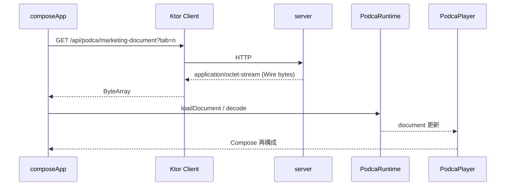
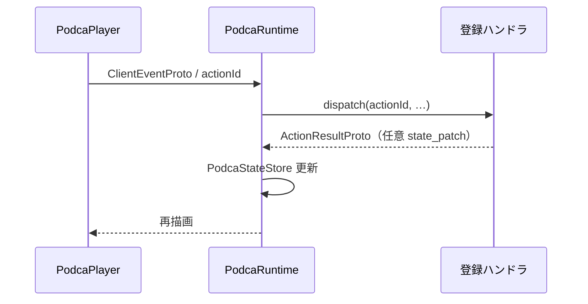
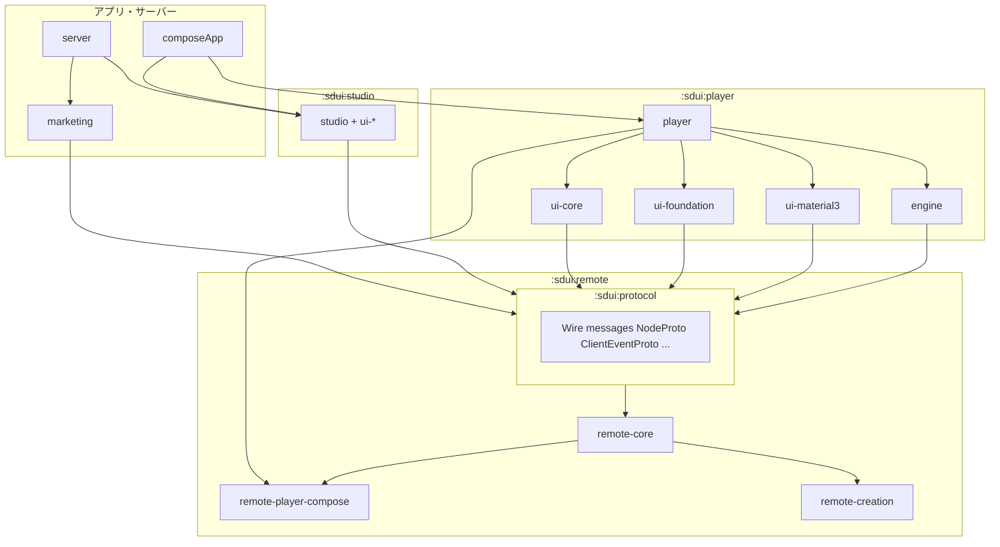

# Podca 詳細設計書（v1）

| 項目 | 内容 |
|------|------|
| 文書種別 | 詳細設計（シーケンス・前処理パイプライン・エラー・検証） |
| 版 | v1.1（ワイヤ表・振分け図・検証ゲートまで反映） |
| 上位文書 | [BASIC_DESIGN_v1.md](./BASIC_DESIGN_v1.md) |
| 実装の正 | `sdui/**/*.proto`、各モジュール README、単体テスト |

---

## 1. トレーサビリティ（基本設計 §2 受入条件）

| 基本設計 ID | 本書での扱い |
|-------------|----------------|
| **A-1** | §3.2、§10（`PodcaRenderDocumentNode` 振分け）、§7（E1 注記） |
| **A-2** | §2.1 |
| **A-3** | §3.1、§4.1 |
| **A-4** | §3.3、§9 |
| **B-1** | §5.1 |
| **B-2** / **B-3** | §2.2 |
| **B-4** | §6.2、§5.2 |
| **B-5** | §5.3、§13 |

---

## 2. アーキテクチャ詳細

### 2.1 モジュール依存（要約）

```text
:sdui:protocol
    ↑ (:sdui:studio:* , :sdui:player:engine , :sdui:remote:remote-core , :sdui:marketing 等)

:sdui:remote:remote-core          # .proto / Wire / expand・filter 純関数
    ↑
:sdui:remote:remote-player-compose  # CMP インタプリタ（:player:engine 等に依存）
:sdui:remote:remote-creation        # プログラム組み立て・テスト

:sdui:player:player               # PodcaPlayer 入口 → 各 ui-* レンダラー + Remote 委譲
```

**拡張順（再掲）**: upstream 意味確定 → `remote-core` → `remote-player-compose` → `remote-creation` → テスト → [ANDROIDX_REMOTE_MAP.md](../../sdui/remote/ANDROIDX_REMOTE_MAP.md) 更新（[AGENTS.md](../../AGENTS.md)）。

### 2.2 Remote と AndroidX の関係

- **契約の一覧とギャップ**は [ANDROIDX_REMOTE_MAP.md](../../sdui/remote/ANDROIDX_REMOTE_MAP.md) を単一参照とする。
- 新規 op / フィールド追加時は **同一 PR（または直後の PR）でマップ行を更新**する（レビュー観点: 「どの AndroidX API に対応するか」）。

---

## 3. シーケンス

### 3.1 マーケ文書の取得と再生（サンプル本流）



- **クエリ**: `tab` は整数 **0..3**（欠損・範囲外はサーバー側で **0 に正規化**。実装: `Application.kt` の `coerceIn(0, 3)`）。
- **フォールバック**: ネットワーク失敗時にクライアントが `encodePodcaMarketingDocument` 等で組み立てる経路は **補助**（[AGENTS.md](../../AGENTS.md)）。

### 3.2 ドキュメント読み込み（論理）

1. バイト列を `NodeProto`（またはドキュメントラッパ）として **Wire decode**。
2. `PodcaDocumentController` がツリーを保持（[sdui/ARCHITECTURE.md](../../sdui/ARCHITECTURE.md)）。
3. `PodcaRenderDocumentNode` が `type` により分岐し、`remote.CanvasProgram` / `remote.Node` は **`remote-player-compose`** へ委譲。

### 3.3 アクションと状態



- **`actionId`**: サーバー／Studio が付与した識別子。ホストが **`runtime.register`** で実装を束ねる（デモの境界は [AGENTS.md](../../AGENTS.md)）。

---

## 4. サンプルサーバー HTTP API

| メソッド・パス | 応答 | 備考 |
|----------------|------|------|
| `GET /api/health` | `text/plain` ≈ `ok` | 生存確認 |
| `GET /api/podca/marketing-document?tab={0..3}` | `application/octet-stream` | Wire エンコード済みマーケドキュメント |
| `GET /api/podca/welcome-document` | `application/octet-stream` | ウェルカム用バイト列 |
| `GET /` | HTML または案内テキスト | `PODCA_SITE_ROOT` 未設定時はビルド手順を返す場合あり（`Application.kt`） |

CORS: `GET` / `OPTIONS`、`Content-Type` ヘッダ許可、`anyHost()`（サンプル用。本番設計では制限を検討）。

---

## 5. 検証・CI

### 5.1 ターゲットマトリクス（`composeApp`）

| Kotlin target | 用途 | Remote / Player |
|----------------|------|-------------------|
| `android` | モバイル | CMP 共有コード + Android actual |
| `iosArm64` / `iosSimulatorArm64` | iOS | 同上 |
| `jvm` | デスクトップ | 同上 |
| `js`（browser） | Web | `webMain` 経由で podca intro |
| `wasmJs`（browser） | Web | 同上 |

v1 の **B-1** は、上記各ターゲットで **`composeApp` が要求する依存グラフが解決しビルド可能**であることを意味する（日々のゲートコマンドはプロジェクトの `build.gradle.kts` / CI 定義に従う）。

### 5.2 プラットフォーム差の扱い

- proto コメントおよび [ANDROIDX_REMOTE_MAP.md](../../sdui/remote/ANDROIDX_REMOTE_MAP.md) に **「Android のみ反映」**等が書かれたフラグは、他ターゲットでは **無視**（no-op）とし、**同一ワイヤ**でデコード可能であること。
- 将来、他ターゲットで同等 API が揃った場合は **マップを更新**し、必要なら `expect/actual` を player 側に閉じる。

### 5.3 Remote 固定ゲート

- リポジトリルート: **`./gradlew remoteVerifyJvm`**
- 対象: `:sdui:remote:remote-core`、`:sdui:remote:remote-creation`、`:sdui:remote:remote-player-compose` の JVM コンパイルと `jvmTest`（Wire 再生成含む）。

### 5.4 広い SDUI

- モジュール単位の `check` / `jvmTest` / プラットフォームテストは **各 `build.gradle.kts`** に従う。v1 では **protocol / player / studio の破壊的変更に対する回帰**を PR 単位で通す。

---

## 6. Remote Canvas：前処理と評価順

### 6.1 再生前（`remote-player-compose`）

`PodcaRenderRemoteCanvasProgram` における **`RemoteCanvasProgramProto` の準備**（要約）:

1. **`expandRemoteCanvasLoopBlocks(program)`**  
   - `LOOP_BEGIN` / `LOOP_END` を **描画前**にフラット化する（`remote-core` の `RemoteCanvasLoopExpand.kt`）。  
   - `RemoteCanvasProgramProto.loop_expand_max_repeat_per_block` が **0** のときは **既定上限 512**／ブロック（`LOOP_BEGIN` ごとに `loop_repeat_count` をクランプ）。  
   - **ネストしたループ**も再帰的に展開。オフスクリーンブロック内も **同一ルール**。

2. **`remoteCanvasStateLayoutSemanticsHintsForPlayback(expanded, activeId)`**  
3. **`filterRemoteCanvasStateLayoutBlocksForPlayback(expanded, activeId)`**  
   - アクティブでない `STATE_LAYOUT_*` 枝を **op 列から除去**（`remote-core`）。アクティブ id は **`PodcaRuntime.remoteCanvasStateLayoutActiveId`** またはデフォルト解決（実装コメント参照）。

**`CONDITIONAL_BEGIN` / `CONDITIONAL_END`**: ループ展開 **後**の op 列に対し、インタプリタが **描画時**に分岐評価（`resolveRemoteCanvasConditionalOperands` / `evalRemoteCanvasConditionalBranch`）。したがって **ループ展開は条件の真偽を見ない**（[ANDROIDX_REMOTE_MAP.md](../../sdui/remote/ANDROIDX_REMOTE_MAP.md) の「評価順」節と同趣旨）。

> **運用注意**: `CONDITIONAL` の内側に大きな `LOOP` を置いても、**展開後の op 数は減らない**。重い繰り返しは条件の外に出すか、ループ回数上限を設計する。

### 6.2 `wire_opset_version`

- プログラムの **`wire_opset_version`** がプレイヤーの **`SupportedWireOpsetVersion`** を超える場合、そのフレームは **描画しない**（空 `Box` 相当。実装は `remote-player-compose`）。
- **意味変更**で世代を上げる場合は **`SupportedWireOpsetVersion` を同リリースで更新**（[AGENTS.md](../../AGENTS.md)）。

---

## 7. エラー・異常系（分類）

| 区分 | 例 | 期待動作（v1） |
|------|-----|----------------|
| **E1 Wire decode 失敗** | 壊れたバイト列 | アプリは **クラッシュせず**、上位でフォールバック UI またはエラー表示（ホスト責務）。 |
| **E2 未知の `NodeProto.type`** | 将来のノード | Player は **子の再帰のみ**等、フォールスルー方針（[ARCHITECTURE.md](../../sdui/ARCHITECTURE.md)）。 |
| **E3 Remote 世代不一致** | `wire_opset_version` 過大 | §6.2：該当 canvas を **スキップ**。 |
| **E4 条件付き float 欠損** | 未知 id | `remote-core` 定義に従い **NaN 等**として比較（マップ・proto 参照）。 |

ログレベル・メトリクス送信は **ホストアプリ**の方針とする（本書では分類のみ固定）。

---

## 8. セキュリティ（サンプル以上の本番向けメモ）

- **ペイロードサイズ上限**: `GET /api/podca/*` の応答および任意の `loadDocument(bytes)` 入力に対し、**リバースプロキシまたはアプリ側**で上限を設ける。**推奨初期値**: 単一ドキュメント **16 MiB**（超過時は 413 またはアプリ内エラー）。SDUI ツリーがこれを超える設計は避ける。
- **ツリー深さ／子数**: ワイヤ上は無制限に近いため、本番では **再帰デコード時のスタック**と **メモリ**を考慮し、サーバー encode 時に **深さ・子ノード数の上限**を課すことを推奨（数値は製品決定）。
- **静的サイト配信**: `PODCA_SITE_ROOT` で wasm 成果物を配信する経路は **読み取り専用ディレクトリ**に限定する。

---

## 9. アクション・状態ワイヤ（`sdui/core/Action.proto`）

契約の **正** はリポジトリ内の `.proto`。**実装参照**: `PodcaDocumentController.dispatch`、`PodcaActionDispatcher`、`PodcaStateStore.applyActionResult`。

### 9.1 `ClientEventProto`（クライアント → ハンドラ）

| フィールド | 型 | 意味 |
|------------|-----|------|
| `event_id` | `string` | 相関用 ID（`PodcaEventId` 等から生成） |
| `node_key` | `string` | 対象ノードの `key` |
| `action_id` | `string` | 解決した `ActionBindingProto.action_id` |
| `trigger` | `ActionTriggerProto` | クリック／値変更等（enum §9.3） |
| `arguments` | `repeated ActionArgumentProto` | 名前付き引数（oneof 値） |
| `client_timestamp_epoch_millis` | `int64` | クライアント時刻（エポック ms） |

### 9.2 `ActionResultProto`（ハンドラ → ランタイム）

| フィールド | 型 | 意味 |
|------------|-----|------|
| `event_id` | `string` | 処理したイベント ID（相関） |
| `accepted` | `bool` | 受理可否。未登録 `action_id` 時は `false`＋`error_message`（`PodcaActionDispatcher`） |
| `error_message` | `string` | 拒否・失敗時の人間可読メッセージ |
| `state_patch` | `StatePatchProto` | 任意。非 null かつ `applyActionResult` で **ルート差し替え**に使用 |

### 9.3 `StatePatchProto`

| フィールド | 型 | 意味 |
|------------|-----|------|
| `encoded_root` | `bytes` | **新しいルート** `NodeProto` の Wire エンコード全体 |
| `revision` | `int64` | `PodcaStateStore` がそのまま採用するリビジョン |

### 9.4 `ActionTriggerProto`（抜粋）

| 値 | 意味 |
|----|------|
| `ACTION_TRIGGER_UNSPECIFIED` | 未指定 |
| `ACTION_TRIGGER_CLICK` | クリック |
| `ACTION_TRIGGER_LONG_CLICK` | ロングクリック |
| `ACTION_TRIGGER_VALUE_CHANGE` | 値変更 |
| `ACTION_TRIGGER_SUBMIT` | 送信 |
| `ACTION_TRIGGER_DISMISS` | 閉じる |

### 9.5 `ActionBindingProto` / `ActionArgumentProto`

- **`ActionBindingProto`**: `trigger`, `action_id`, `arguments`, `expects_state_update`（将来の最適化ヒント用。現行 `dispatch` の成否は `ActionResultProto` で表現）。
- **`ActionArgumentProto`**: `name` ＋ `oneof`（`string_value` / `int_value` / `double_value` / `bool_value` / `bytes_value`）。

---

## 10. `PodcaRenderDocumentNode` 振分け（実装固定）

実装: `sdui/player/player/.../PodcaPlayer.kt` の `when`。**順序が意味を持つ**（先にマッチした分岐が採用される）。

| 条件 | 描画委譲先 | 備考 |
|------|------------|------|
| `type == "Root"` | `Column` + `PodcaRenderChildren` | ルートレイアウト |
| `type == "remote.CanvasProgram"` | `PodcaRenderRemoteCanvasProgramNode` | op 列インタプリタ |
| `type == "remote.Node"` | `PodcaRenderRemoteDocumentNode` | 宣言的 Remote 糖衣 |
| `type.startsWith("foundation.")` | `PodcaRenderFoundationNode` | |
| `type.startsWith("material3.")` | `PodcaRenderMaterial3Node` | `runtime` を渡す |
| `type.startsWith("ui.")` | `PodcaRenderUiNode` | |
| **else** | `PodcaRenderChildren` のみ | **未知 type はここに落ちる**（子再帰のみ・非クラッシュ） |

---

## 11. `PodcaRuntime` と Remote 補助（実装概要）

`PodcaRuntime`（`PodcaDocumentController` を内包）がホストの入口。

| API / StateFlow | 役割 |
|-----------------|------|
| `document` / `revision` | 現在ツリーとリビジョン |
| `loadDocument(bytes)` | `decodePodcaDocument` → `setDocument` |
| `dispatch(nodeKey, trigger, arguments)` | ノードの `actions` から binding を解決し `ClientEventProto` を送出 |
| `dispatch(nodeKey, action)` | binding 不一致を許容する経路（Remote 糖衣等） |
| `register` / `unregister` | `action_id` → `PodcaActionHandler` |
| `remoteCanvasConditionalFloats` | `CONDITIONAL_*` の名前付き float。`put` / `remove` で更新 |
| `remoteCanvasStateLayoutActiveId` | `STATE_LAYOUT_*` のアクティブ枝 id（`null`＝wire 既定解決） |

---

## 12. パッケージ／モジュール構成図（v1）



---

## 13. 検証コマンドと CI

### 13.1 リポジトリに定義済みのゲート（必須レベル）

| コマンド | 目的 |
|----------|------|
| `./gradlew remoteVerifyJvm` | Remote: Wire 再生成、`remote-core` / `remote-creation` / `remote-player-compose` の JVM コンパイル＋`jvmTest` |

### 13.2 広い SDUI・サンプル（PR 前の推奨）

| コマンド | 目的 |
|----------|------|
| `./gradlew :sdui:player:engine:jvmTest` | ドキュメントコントローラ・アクションの回帰 |
| `./gradlew :composeApp:assembleDebug` 等 | Android ターゲットのビルド可能性（ローカル SDK 前提） |
| `./gradlew :server:build` | サンプル Ktor のコンパイル・テスト |

※ **GitHub Actions 等の YAML は本リポジトリ v1 時点では未同梱**のため、CI ジョブ名の一覧は「組み込み済み」とは書かない。追加時は本節と [docs/design/README.md](./README.md) を更新する。

---

## 14. v1 設計書としての「完成」宣言と是正メモ

次を満たすとき、**v1 の詳細設計書は完成**とみなす。

1. **§9〜§11** が `.proto` および `PodcaPlayer` / `PodcaRuntime` の **現行実装と一致**していること（本版で反映済み）。
2. **§10** の振分け表が `PodcaRenderDocumentNode` の `when` と **同一**であること（本版で反映済み）。
3. **§6** の Remote 前処理順が `PodcaRenderRemoteCanvasProgram` と **一致**していること（本版で反映済み）。

**E1（§7）との整合**: `decodePodcaDocument` は内部で `NodeProto.ADAPTER.decode(bytes)` を呼び、**不正バイト列では例外**になり得る。基本設計 **A-1** の「非クラッシュ」を厳密に満たすには、**`loadDocument` 呼び出し側で try/catch** する。設計上の推奨: ホストは **`loadDocument` をラップ**し、失敗時は文書を null のままにしフォールバック UI を出す。

---

## 15. 改訂履歴

| 版 | 日付 | 変更 |
|----|------|------|
| v1.0 | 2026-04-19 | 初版。設計書ディレクトリ `docs/design/` に集約。 |
| v1.1 | 2026-04-19 | §9〜§14 追加（ワイヤ表、Player 振分け、Runtime、Mermaid モジュール図、検証コマンド、v1 完了範囲・E1 注記）。§8 に推奨サイズ。§1 トレーサビリティ更新。 |
