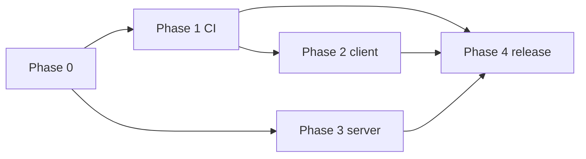

# プロダクト完成計画書 v1.3.1（実行マスタ）

> **文書は完成済み（v1.3.1）。** プロダクト実体の仕上げは **§8 付録 A** のチェックリストと [PRODUCT_STATUS_INCOMPLETE_v1.md](./PRODUCT_STATUS_INCOMPLETE_v1.md) を進める。

| 項目 | 内容 |
|------|------|
| 文書種別 | **プロダクト完成のための実行計画**（順序・優先・ゲート・完了定義の固定） |
| ステータス | **計画書として v1.3.1 で文書完成**（v1.3 同梱物＋§0.1 宣言・付録 F） |
| 上位方針 | [BASIC_DESIGN_v1.md](./BASIC_DESIGN_v1.md) §2（柱 A / B）、[AGENTS.md](../../AGENTS.md) |
| タスク網羅 | [WBS_PRODUCT_COMPLETE_v1.md](./WBS_PRODUCT_COMPLETE_v1.md)（本書は **順序とゲート**に特化し、WBS と二重に全列挙しない） |
| ギャップ一覧 | [PRODUCT_STATUS_INCOMPLETE_v1.md](./PRODUCT_STATUS_INCOMPLETE_v1.md) |
| 技術詳細 | [DETAILED_DESIGN_v1.md](./DETAILED_DESIGN_v1.md) |

---

## 0. 計画書の範囲（本書が「完成」と言えること）

- **本書 v1.3.1** は、v1.3 に **§0.1（計画書文書の完成宣言）** と **付録 F（アーティファクト一覧）** を追加し、**計画書としての増ペースを打ち切った**。
- **本書 v1.3** は、v1.2 に加え **[`.github/pull_request_template.md`](../../.github/pull_request_template.md)** と **[`CONTRIBUTING.md`](../../CONTRIBUTING.md)** を同梱し、Phase 1 の **「PR テンプレ／CONTRIBUTING」ゲートを文書・リポジトリの両方で充足**した。
- **本書 v1.2**: **`.github/workflows/track-r-core.yml`**、**[SMOKE_TRACK_R.md](./SMOKE_TRACK_R.md)**（付録 E）。
- **本書 v1.1**: 付録 A〜C、§3.1 クリティカルパス。
- **本書 v1.0**: フェーズ・P0–P2・Track R/S・リスク。
- **全作業の末端タスク列挙**は [WBS](./WBS_PRODUCT_COMPLETE_v1.md) に一任する。本書では WBS の章番号を **参照**するのみとする。
- **ソースコードの実装完了**は本書の締結ではない。**実装は各フェーズのゲートを満たすコミット**で追う。

### 0.1 計画書（文書）の完成宣言

**本リポジトリに置く「プロダクト完成計画書」としての執筆タスクは v1.3.1 で打ち切る。** 以降、本章・付録 A〜F に **新セクションを増やすのは**（1）Track R 達成日・タグの **1 行追記**、（2）組織・ブランチ名の **差し替え**、（3）**v2 計画書**の別ファイル化、のいずれかに限る。

**プロダクト実体**（Track R の全チェックが緑、本番 server 等）は引き続き [PRODUCT_STATUS_INCOMPLETE_v1.md](./PRODUCT_STATUS_INCOMPLETE_v1.md) と付録 A の `[ ]` で追う。

---

## 1. 完了の定義（プロダクトが「完成」した判定）

次の **2 トラック**を定義する。**リリース判定は Track R を必須**とし、Track S は製品ポリシーで必須化するか選択する。

### 1.1 Track R — **リリース完成（必須）**

次を **すべて**満たすこと。

| # | 条件 | 根拠・参照 |
|---|------|------------|
| R1 | `composeApp` の **android / iosArm64 / iosSimulatorArm64 / jvm / js / wasmJs** が **CI または手動でコンパイル成功**（**R1-min**＝JVM 等は `track-r-core` で必須、**R1-full**＝全ターゲットは週次ローテ or 追補 job／付録 A） | 基本設計 B-1、WBS 1.2.4 |
| R2 | **`./gradlew remoteVerifyJvm`** と **`:sdui:player:engine:jvmTest`** が **main マージ前に必須** | 基本設計 B-5、詳細設計 §13 |
| R3 | マーケ UI が **`sdui/marketing`** のみをソースとし、**HTTP 取得が主路**、クライアント encode はフォールバック | 柱 A-3、[AGENTS.md](../../AGENTS.md) |
| R4 | **`loadDocument` 前後の try/catch** により、不正バイト列で **プロセスを落とさない**（フォールバック UI） | 詳細設計 §14、WBS 2.4.1 |
| R5 | サンプル `server` が **許可オリジン付き CORS** と **レスポンスサイズ上限**（推奨 16 MiB 以内）を満たす | 詳細設計 §8、WBS 4.2 |
| R6 | **スモークシート**（全タブ・主要操作）が **1 リリースサイクル内に全項目パス** | WBS 5.1.4 |

### 1.2 Track S — **厳密 SDUI / Remote（任意の「完成」）**

基本設計 §2 の **A-1〜A-4** および **B-2〜B-3** を **字面どおり**満たすこと（例: マップ上 **「—」ゼロ**、**△** をすべて ✓ にする等）。**工数大のため Track R とは切り離す。** 採用する場合は **別マイルストーン**（例: v2.0）とし、Issue に P 付けする（[STATUS](./PRODUCT_STATUS_INCOMPLETE_v1.md) §2）。

---

## 2. 優先度マトリクス（P0 / P1 / P2）

| 優先度 | 含めるもの（要約） | WBS 参照 |
|--------|---------------------|----------|
| **P0** | Track R 全項目、PR チェックリスト、CI 最小、server CORS・サイズ上限、`loadDocument` 安全化 | 1.2.*、2.4.1、4.* |
| **P1** | マップ △ のうち **実際にマーケ／製品が使う Remote 拡張**、広い SDUI の不足ノード、CONTRIBUTING、CHANGELOG | 2.*、3.*、7.* |
| **P2** | Track S に近い Remote 完全parity、部分 state_patch、Docker/TLS 本番、Dokka 公開 | 3.*、4.2、7.5、8.* |

---

## 3. フェーズ計画（順序固定・ゲート付き）

**期間**は並列人員 **1 FTE 相当**の目安。人数を増やせば短縮可。

### Phase 0 — 合意固定（**≤ 3 営業日**）

| 成果物 | ゲート（出口） |
|--------|----------------|
| Track R を **リリース完成の定義**として承認 | README または本書へのリンクと、会議メモ／Issue 1 件 |
| Track S を **v2 扱いにするか**決定 | Issue ラベル `track-s` 方針コメント |
| P0 範囲の確定 | [WBS 1.1.1](./WBS_PRODUCT_COMPLETE_v1.md) 相当のチェックリストを Issue 化 |

**依存**: なし。

---

### Phase 1 — CI と工程（**1 〜 2 週**）

| 成果物 | ゲート |
|--------|--------|
| **同梱**: [`.github/workflows/track-r-core.yml`](../../.github/workflows/track-r-core.yml) で **`remoteVerifyJvm`**・`:sdui:player:engine:jvmTest`・`:server:build`・`:composeApp:compileKotlinJvm` を一括実行 | main の PR で **必須チェック緑**（ブランチ保護で `track-r-core` job を必須化） |
| **同梱**: [`.github/pull_request_template.md`](../../.github/pull_request_template.md) ＋ **[`CONTRIBUTING.md`](../../CONTRIBUTING.md)**（proto→player→creation・マップ・計画書リンク） | 新規 PR でテンプレが表示されること |
| （任意）週 1 ターゲットの **KMP compile smoke** | 失敗時は Issue 起票ルール |

**依存**: Phase 0。  
**WBS**: 1.2.*、7.3。

---

### Phase 2 — クライアント堅牢化（**1 週**）

| 成果物 | ゲート |
|--------|--------|
| `composeApp` の `loadDocument` 経路に **try/catch**、失敗時フォールバック | 手動または簡易テストで **壊バイト列**を投入して落ちないこと |
| マーケ取得失敗 → フォールバック encode の **ログ方針**（1 行でよい） | コードコメントまたは README |

**依存**: Phase 1（CI は並行可）。  
**WBS**: 2.4.1、4.1.3。

---

### Phase 3 — サーバー本番最低限（**1 週**）

| 成果物 | ゲート |
|--------|--------|
| CORS を **明示オリジン**に変更（`anyHost` 撤廃） | ステージング URL でブラウザからマーケ API が取得できる |
| `marketing-document` 応答に **上限**（例: 16 MiB）超過時 413 または 400 | 単体テストまたは手動 |
| README に **本番環境変数**（`PODCA_SITE_ROOT`、ポート、CORS オリジン）を記載 | レビュー承認 |

**依存**: Phase 0。Phase 2 と並行可。  
**WBS**: 4.2.*、6.*。

---

### Phase 4 — リリーススモークと文書（**3 〜 5 営業日**）

| 成果物 | ゲート |
|--------|--------|
| スモークシート（表: ターゲット × タブ × 操作） | 全 **Pass** 署名（オーナー 1 名） |
| **CHANGELOG** に Track R 達成を記載 | タグ付け前にマージ |
| **STATUS** を更新（「Track R 達成」日付） | [PRODUCT_STATUS_INCOMPLETE_v1.md](./PRODUCT_STATUS_INCOMPLETE_v1.md) に完了節を追記 |

**依存**: Phase 1〜3。  
**WBS**: 5.1.4、8.2。

---

### Phase 5 — Track S（**継続・バックログ**）

- [ANDROIDX_REMOTE_MAP.md](../../sdui/remote/ANDROIDX_REMOTE_MAP.md) の **△** を Issue 化し、**プロダクトが必要な順**に [拡張順](../../AGENTS.md) で実装する。
- **本計画書の Track R スコープ外**として扱い、**v2 計画書**で再締結する。

---

## 3.1 クリティカルパスと並行

| 順序 | ブロック | 依存 | 他フェーズとの並行 |
|------|-----------|------|---------------------|
| CP1 | Phase 0 | なし | — |
| CP2 | Phase 1 | Phase 0 | Phase 3 と **並行可**（人員分離時） |
| CP3 | Phase 2 | Phase 0（Phase 1 と並行可だが **R2 は Phase 1 後が安全**） | Phase 3 と並行可 |
| CP4 | Phase 4 | **Phase 1 完了必須**（R2）、**Phase 2・3 の成果**推奨（R4・R5） | Phase 3 完了後にスモークをまとめるのが効率的 |



---

## 4. ワークストリームと責務（推奨）

| ストリーム | 主担当（例） | 主成果 |
|------------|--------------|--------|
| **WS-A** SDK | `sdui/protocol`・`studio`・`player` | 柱 A のノード・encode/decode |
| **WS-B** Remote | `remote-core` / `remote-player-compose` / `remote-creation` | マップ準拠・`remoteVerifyJvm` |
| **WS-C** サンプル | `composeApp`・`server`・`marketing` | Track R のデモ本流・CORS |
| **WS-D** 品質 | CI・スモーク・回帰 | ゲート維持 |

---

## 5. リスク上位と緩和（計画に織り込み済み）

| リスク | 緩和（本計画での位置） |
|--------|-------------------------|
| Track R と S の混同 | §1 でトラック分離、Phase 5 で S を外だし |
| CI 未整備による回帰 | Phase 1 を **P0 最優先** |
| 不正バイト列でクラッシュ | Phase 2、Track R4 |
| CORS 任意ホスト | Phase 3、Track R5 |
| Remote △ の無制限実装 | Track S = Phase 5、WBS 3.T.* の順守 |

---

## 6. 計画書の保守

| タイミング | 作業 |
|------------|------|
| **Track R 達成時** | 本書改訂履歴に **R 達成日**・**Git タグ名**を 1 行追記（例: v1.3.2）。§0.1 の方針に従い本文の増殖を避ける |
| **四半期** | P0/P1 の見直し、WBS との差分チェック |
| **Track S を製品必須にした場合** | v2 計画書を別立てし、本書 §1.2 を参照先に |

---

## 7. 参照関係（1 ページの地図）

```text
PRODUCT_COMPLETION_PLAN_v1.md（本書）… 実行順・ゲート・Track R/S
    ├── .github/workflows/track-r-core.yml … Phase 1 CI（同梱）
    ├── .github/pull_request_template.md … PR チェックリスト（同梱）
    ├── CONTRIBUTING.md … 入口・コマンド（同梱）
    ├── SMOKE_TRACK_R.md … R6 スモーク表
    ├── WBS_PRODUCT_COMPLETE_v1.md … 全タスク分解
    ├── PRODUCT_STATUS_INCOMPLETE_v1.md … 現状ギャップ
    ├── BASIC_DESIGN_v1.md … 受入条件の源流
    └── DETAILED_DESIGN_v1.md … シーケンス・検証コマンド
    └── 付録 F … 上記パスの一覧表（本書 §13）
```

---

## 8. 付録 A — Track R 受入チェックリスト（そのまま Issue / PR に転記可）

コピー用（完了したら `[x]` にする）。**成果物パスは付録 F**。

> 2026-04-20 時点メモ: ローカルでは R1a–f / R2a,b / R3 / R4 / R5a,b / R6 を実行済み。  
> 未チェックの R1-min / R2（必須チェック設定）は GitHub 側（リモート実行結果・ブランチ保護）での確認が必要。

- [ ] **R1-min** リポジトリの **`track-r-core`** GitHub Actions が **緑**（[`.github/workflows/track-r-core.yml`](../../.github/workflows/track-r-core.yml) = `remoteVerifyJvm` + `engine:jvmTest` + `server:build` + `compileKotlinJvm` + `compileKotlinJs` + `compileKotlinWasmJs`）
- [x] **R1a** `./gradlew :composeApp:assembleDebug`
- [x] **R1b** `./gradlew :composeApp:compileKotlinIosArm64`
- [x] **R1c** `./gradlew :composeApp:compileKotlinIosSimulatorArm64`
- [x] **R1d** `./gradlew :composeApp:compileKotlinJvm`
- [x] **R1e** `./gradlew :composeApp:compileKotlinJs`
- [x] **R1f** `./gradlew :composeApp:compileKotlinWasmJs`
- [ ] **R1 ローテーション運用**（週次で R1a–f を割り当てる場合）: CI マトリクスに **週替わり job** を 1 本追加し、6 週で全ターゲットを 1 巡する、**または** PR ごとに `matrix.target` で全件（時間増）

- [x] **R2a** `./gradlew remoteVerifyJvm`
- [x] **R2b** `./gradlew :sdui:player:engine:jvmTest`
- [ ] **R2** 上記 2 つが **default branch の必須チェック**に付いている（**`track-r-core` に含まれる場合は R2a・R2b を同時充足**）

- [x] **R3** `PodcaIntro`（または同等）で **HTTP 取得が先**、`encodePodcaMarketingDocument` は **取得失敗時のみ**（コードレビューで確認）

- [x] **R4** `loadDocument`（または `decodePodcaDocument` 呼び出し）を **try/catch** で囲み、失敗時に **フォールバック UI** へ遷移（壊バイト列で 1 回検証）

- [x] **R5a** `server` CORS が **`anyHost` ではない**（許可オリジン明示）
- [x] **R5b** `marketing-document`（および必要なら `welcome-document`）の **最大バイト数**を超えたとき **413 または 400**（テストまたは手動）

- [x] **R6** スモーク表（ターゲット × タブ × 操作）の **全 Pass** とオーナー署名・日付

---

## 9. 付録 B — Phase 0 Issue ひな形（タイトル例）

```text
Title: [Phase 0] Track R をリリース完成定義として承認する

本文:
- 参照: docs/design/PRODUCT_COMPLETION_PLAN_v1.md §1.1 Track R
- 決定事項: Track R を vX.Y のリリースゲートとする / Track S は v2 バックログとする
- 承認者: @...
- 期限: 3 営業日以内
```

---

## 10. 付録 C — ローカル検証コマンド早見（Track R 関連）

| 目的 | コマンド |
|------|----------|
| Remote 回帰 | `./gradlew remoteVerifyJvm` |
| Player engine | `./gradlew :sdui:player:engine:jvmTest` |
| Server | `./gradlew :server:build` |
| composeApp JVM | `./gradlew :composeApp:compileKotlinJvm` |

---

## 11. 付録 D — 同梱 CI・PR 規約（Phase 1 の成果物）

| ファイル | 役割 |
|----------|------|
| [`.github/workflows/track-r-core.yml`](../../.github/workflows/track-r-core.yml) | `push`/`pull_request` to **`main`**。Ubuntu、Temurin **17**。`remoteVerifyJvm`、`:sdui:player:engine:jvmTest`、`:server:build`、`:composeApp:assembleDebug`、`:composeApp:compileKotlinIosArm64`、`:composeApp:compileKotlinIosSimulatorArm64`、`:composeApp:compileKotlinJvm`、`:composeApp:compileKotlinJs`、`:composeApp:compileKotlinWasmJs`。 |
| [`.github/workflows/track-r-smoke.yml`](../../.github/workflows/track-r-smoke.yml) | `workflow_dispatch` + 週次 `schedule`。`remote-player-jvm` / `server-api` / `compose-multitarget-compile` の matrix スモーク。 |
| [`.github/pull_request_template.md`](../../.github/pull_request_template.md) | Remote / SDUI / マーケの **レビューチェックリスト** |
| [`CONTRIBUTING.md`](../../CONTRIBUTING.md) | 入口コマンド・AGENTS への誘導・計画書リンク |

**含めないもの（理由）**: なし（Track R1a–f の compile/build を `track-r-core` に集約）。

**ブランチ保護**: GitHub → Settings → Rules → `main` に **必須ステータスチェック** `track-r-core / …` を追加する（Phase 1 ゲート）。

---

## 12. 付録 E — スモーク表（R6）

同梱ファイル: **[SMOKE_TRACK_R.md](./SMOKE_TRACK_R.md)**（行追加・`[x]` 更新で運用）。

追記例: iOS（シミュレータ）、`js` ターゲット、オフライン時フォールバック encode など。

---

## 13. 付録 F — 計画書付随アーティファクト一覧（文書完成時点）

| # | アーティファクト | パス | 計画書での位置 |
|---|------------------|------|----------------|
| 1 | 完成計画（本書） | `docs/design/PRODUCT_COMPLETION_PLAN_v1.md` | §0–7、付録 A–E |
| 2 | CI（Track R コア） | `.github/workflows/track-r-core.yml` | 付録 D |
| 3 | PR チェックリスト | `.github/pull_request_template.md` | 付録 D |
| 4 | コントリビューション入口 | `CONTRIBUTING.md` | 付録 D |
| 5 | スモーク表 | `docs/design/SMOKE_TRACK_R.md` | 付録 E |
| 6 | 作業分解 | `docs/design/WBS_PRODUCT_COMPLETE_v1.md` | §7 参照 |
| 7 | 未完整理 | `docs/design/PRODUCT_STATUS_INCOMPLETE_v1.md` | §7 参照 |

---

## 改訂履歴

| 版 | 日付 | 変更 |
|----|------|------|
| v1.0 | 2026-04-19 | 初版。**計画書として締結**。Track R/S、P0–P2、Phase 0–5、ゲート、リスク、保守ポリシー。 |
| v1.1 | 2026-04-19 | **計画書完成**: §3.1 クリティカルパス＋Mermaid、付録 A（Track R チェックリスト）、付録 B（Issue ひな形）、付録 C（コマンド早見）。文書版 v1.1 締結。 |
| v1.2 | 2026-04-19 | **v1.2 締結**: `.github/workflows/track-r-core.yml` 同梱。付録 D（CI 説明・除外理由・ブランチ保護）。付録 E（スモーク表テンプレ）。付録 A に **R1-min**・R2 注記。 |
| v1.3 | 2026-04-19 | **v1.3 最終締結**: `pull_request_template.md`・`CONTRIBUTING.md` 同梱。Phase 1 の PR ゲートを充足。§1 R1 文言を R1-min / R1-full に整合。§2 見出しに P2。 |
| v1.3.1 | 2026-04-19 | **計画書（文書）完成**: §0.1 完成宣言、付録 F（アーティファクト一覧）、§6 改訂番号の修正。タイトル直下に **完成済み**のブロック引用を追加。**以降は Track R 達成の 1 行追記のみ推奨**。 |
